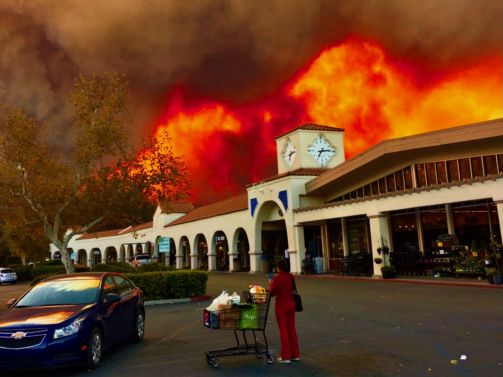

# Thomas Fire Scarring 2017


Image credits: [spookysnoopy via Imgur](https://imgur.com/gallery/thomas-fire-ojai-california-OJdjw)


## About
This repository contains notebooks `hwk4-task2-fire-perimeter-MORRIS-SIBAJA.ipynb` and `hwk4-task2-false-color-MORRIS-SIBAJA.ipynb` whose goal are to analyze the fire scarring of the 2017 Thomas Fire in Santa Barbara and Ventura Counties.

After examining geospatial and tabular datasets, we created a border of the Thomas Fire boundary and overlayed it over a false color map of the fire scarring.
This completed map is located at the bottom of the `hwk4-task2-false-color-MORRIS-SIBAJA.ipynb` notebook.

## Highlights

- Data wrangling and exploration with `pandas` and `rioxarray`
- Geospatial data wrangling with `geopandas` and `rioxarray`
- Merging of tabular and vector data
- Creating and customizing a false color map using `matplotlib.pyplot`

## Data

The data for this analysis is housed in this repository, except for California_Fire_Perimeters_4280901625349411772.geojson, which can be found [here](https://gis.data.cnra.ca.gov/api/download/v1/items/e3802d2abf8741a187e73a9db49d68fe/geojson?layers=0)

## References

[CalFire Fire Perimeter Data](https://www.fire.ca.gov/what-we-do/fire-resource-assessment-program/fire-perimeters)

California Department of Forestry and Fire Protection (CAL FIRE), [calfire_all.gdb], [2024-11-17], retrieved from [CAL FIRE data portal.](https://www.fire.ca.gov/what-we-do/fire-resource-assessment-program/fire-perimeters)

[Landsat Data](https://planetarycomputer.microsoft.com/dataset/landsat-c2-l2) from Microsoft's Planetary Computer Data Catalogue,

- Earth Resources Observation and Science (EROS) Center. (2020). Landsat 4-5 Thematic Mapper Level-2, Collection 2. U.S. Geological Survey. https://doi.org/10.5066/P9IAXOVV
- Earth Resources Observation and Science (EROS) Center. (2020). Landsat 7 Enhanced Thematic Mapper Plus Level-2, Collection 2. U.S. Geological Survey. https://doi.org/10.5066/P9C7I13B
- Earth Resources Observation and Science (EROS) Center. (2020). Landsat 8-9 Operational Land Imager / Thermal Infrared Sensor Level-2, Collection 2. U.S. Geological Survey. https://doi.org/10.5066/P9OGBGM6

Galaz García, Carmen. Assignment4 – EDS 220 - Working with Environmental Datasets. (n.d.). https://meds-eds-220.github.io/MEDS-eds-220-course/assignments/assignment4.html

M. M. Bennett, J. K. Chen, L. F. Alvarez León, and C. J. Gleason, “The politics of pixels: A review and agenda for critical remote sensing,” Progress in Human Geography, vol. 46, no. 3, pp. 729–752, Jun. 2022, doi: 10.1177/03091325221074691. Available: https://journals.sagepub.com/doi/10.1177/03091325221074691. [Accessed: Nov. 23, 2024]

## Repository organization

```
 eds220-hwk4
│   README.md
|   hwk4-task1-reflection-MORRIS-SIBAJA.md
|   hwk4-task2-fire-perimeter-MORRIS-SIBAJA.ipynb
│   hwk4-task2-false-color-MORRIS-SIBAJA.ipynb
|   .gitignore
│
└───data
|   |   landsat8-2018-01-26-sb-simplified.nc
|   |   thomas_2017.geojson
|       California_Fire_Perimeters_4280901625349411772.geojson available from link above
|
└───images
    |   thomas-fire-ojai.jpeg
```
